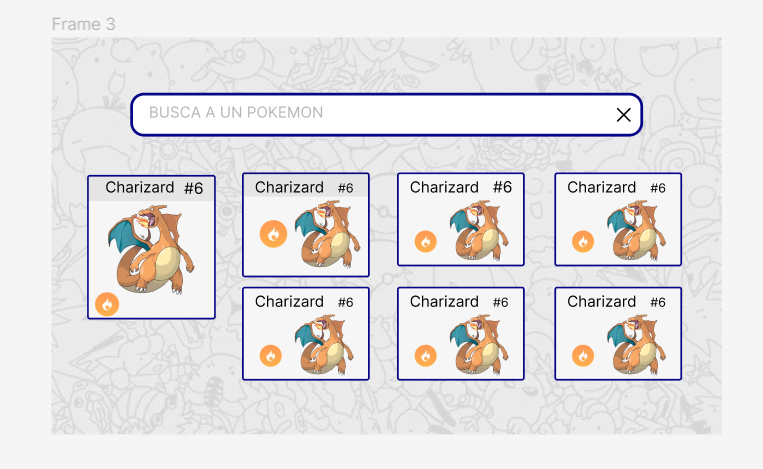
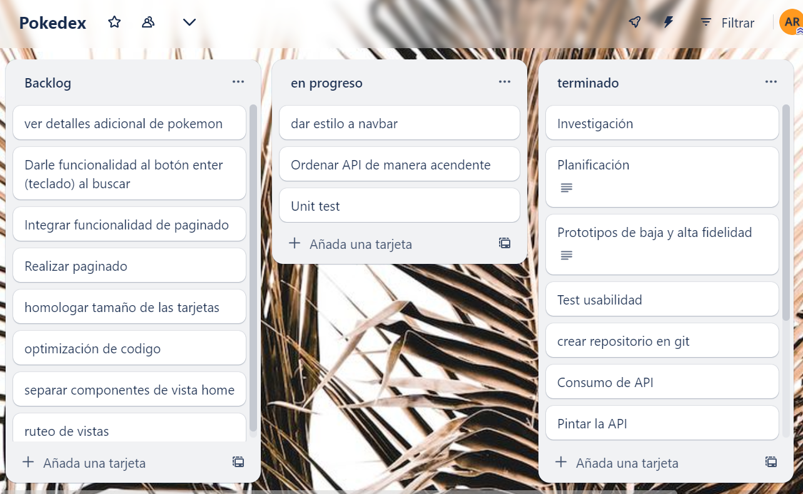
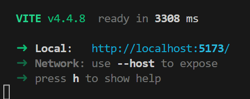

# Pokedex


## Índice

- [Pokedex](#pokedex)
  - [Índice](#índice)
  - [Intruducción](#intruducción)
  - [Objetivos](#objetivos)
  - [Usuabilidad](#usuabilidad)
  - [Prototipos](#prototipos)
    - [Prototipo de baja fidelidad](#prototipo-de-baja-fidelidad)
    - [Prototipo de alta fidelidad](#prototipo-de-alta-fidelidad)
    - [Proyecto terminado](#proyecto-terminado)
    - [Backlog](#backlog)
  - [Tecnologias](#tecnologias)
  - [Configuración del proyecto](#configuración-del-proyecto)
   

## Intruducción 
El siguiente README presenta el proyecto Pokedex, una página web donde se muestra una lista de pokemones, permitiendo al usuario navegar y buscar pokemones de interés.

## Objetivos 

El objetivo de este proyecto es que el usuario pueda ver una lista de pokemones disponibles y filtrarlos mediante una búsqueda por nombre o número.

## Usuabilidad 

Este proyecto está pensado para usuarios que desean conocer y buscar pokemones.

De esta forma, quienes deseen buscar un pokemon ya sea por su número único o por su nombre, podrán encontrarlo en esta página. Todas las funcionalidades que puedes encontrar en este proyecto son:

1. Ver la data de pokemones.
2. Poder realizar una búsqueda filtrando por id único o por nombre.


## Prototipos 

### Prototipo de baja fidelidad 
 
Inicialmente se pensó realizar una página que contenga un buscador y las tarjetas de cada uno de los pokemones, además de agregar una funcionalidad extra en la cual el usuario tendría la opción de poder ver una nueva ventana modal con información adicional de un pokemon seleccionado.

 


### Prototipo de alta fidelidad 

Luego de analizar y pedir feedback del prototipo de baja fidelidad, se realizó la elección de colores y formato de las tarjetas con los pokemones, realizando diferentes pruebas de diseño.



### Proyecto terminado

Mediante la realización del proyecto, se priorizó la funcionalidad de la página y el diseño fue adaptado según la necesidad.

### Backlog
 el panel de planificación quedo asi : 
 


## Tecnologias
Este proyecto se realizó con las siguientes tecnologías: 


## Configuración del proyecto 

Para instalar este proyecto de manera local, necesitas:

- Editor de texto favorito.
- npm (Node Package Manager).
- Git y acceso a GitHub.

1. clonar repositorio
```sh
git clone https://github.com/angelica-rjs/Pokedex
```

2. Instalar dependencias
```sh
npm install
```

3. Para correr el proyecto debes ejecutar el siguiente comando:
```sh
npm run dev
```

4. Abrir el link en el navegador

 
   


